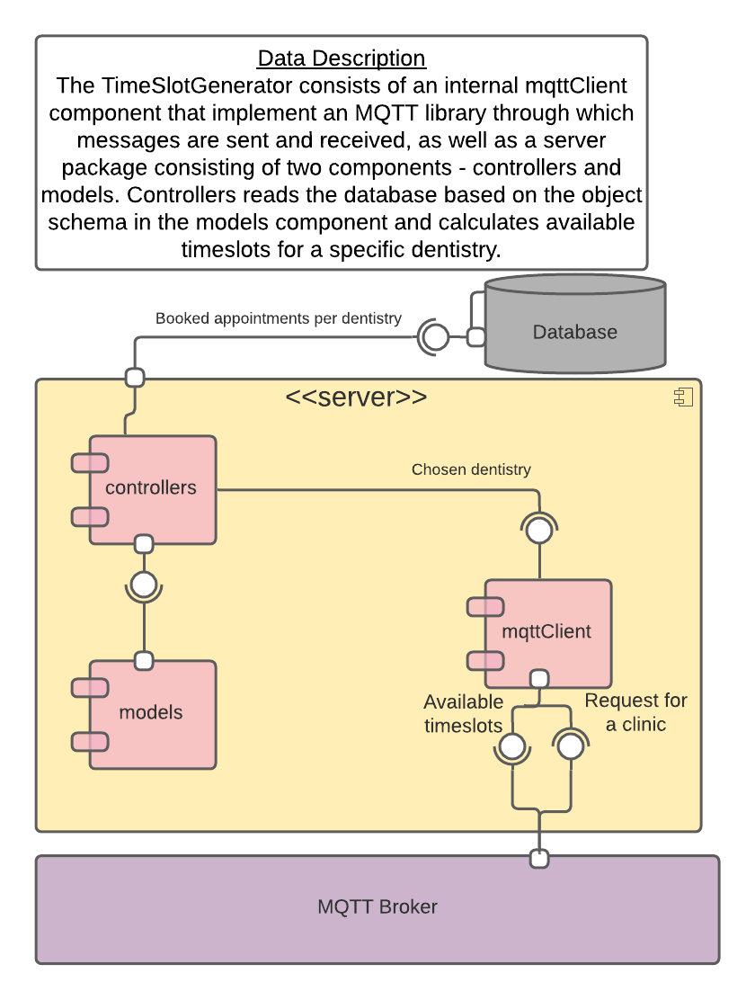

# TimeSlotGenerator

This is the TimeSlotGenerator component which generates available timeslots for dentist appointments based on the dentistry chosen by the user. It does this via an algorithm that subtracts the timeslots of already booked appointments at the dentistry from the dentistry's opening hours, and returns the list of available time slots to the user.


## Server Structure

| File        | Purpose           | 
| ------------- | ------------- |
| [README.md](./README.md) | Everything about the client |
| [Server](./server) | all source code |
| [Controllers](./server/controllers) | all controller code |
| server/controllers/allTimeslots.js | Time slot generator |
| server/controllers/appointments.js | Subtracts already booked timeslots |
| [Models](./server/models) | all model code |
| server/models/appointment.js | Provides appointment object schema |
| server/mqttclient | all mqtt code |


# Component diagram
 


## Requirements

To run the ClinicRegistry the client needs to have the following software installed on their machine.

- Node.js v14.17.6 or later
- mqtt.js v4.2.8 or later

## Project setup
Installs all project dependencies specified in [package.json](./package.json).

1- Map to the client directory. by entering this in the terminal 
```
cd server 
```
2- Install the dependencies >>
```
npm install
```

### Compiles and runs component
3- Run your client on the browser.
```
npm run dev
```

### Compiles and minifies for production
```
npm run build
```

### Lints and fixes files
```
npm run lint
```

### Customize configuration
See [Configuration Reference](https://cli.vuejs.org/config/).
